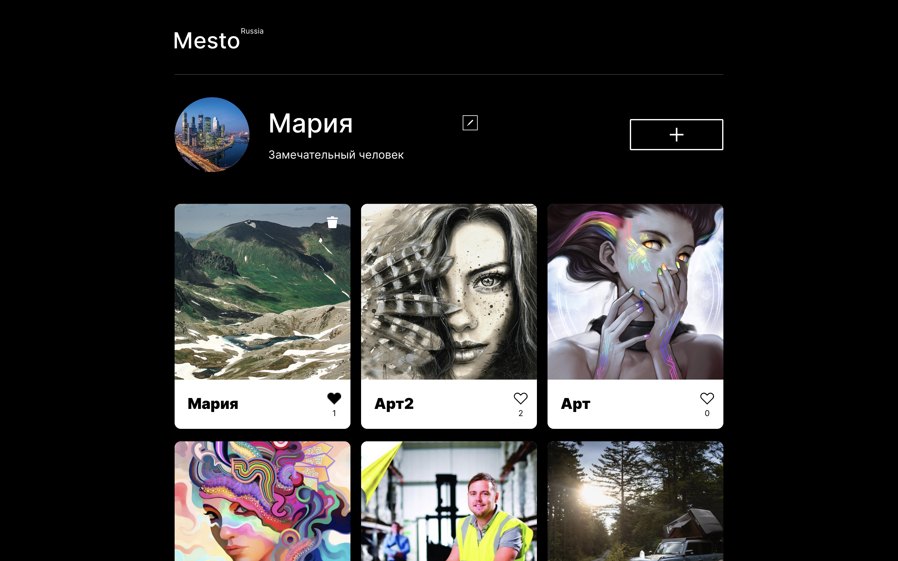

<h1 align="center">Mesto. Опыт путешественников</h1>
<h2 align="center">Проектная работа в рамках обучения на Я.Практикуме</h2>

<h2 align="center"> Используемые технологии &#128187;</h2>

- JavaScript
- React.js
- Git
- HTML
- CSS

<h2 align="center">Описание проекта &#128444</h2>

Первый проект выполненный с помощию популярного фреймворка React.js. Данная работа практически полность повторяет ранее созданный проект по функционалу, только выполнен не на чистом JS, а с использованием React.
[Mesto JavaScript](https://github.com/MariaRez/mesto).
Пользователь может добавлять и удалять места (название и ссылка на картинку), ставить лайки на понравившиеся картинки, именять данные профиля.

<h2 align="center"> Инструкция по развертыванию &#128212;</h2>

Хотите попробовать в использовании данный ресурс?

1. Клонируйте данный репозиторий локально
2. Запустите фронтэнд командой npm run start
3. Наслаждайтесь функционалом &#127881;

<h2 align="center"> Планы по доработке проекта &#128221; </h2>

- Добавить возможность закрытия попапов по клику на overlay
- Реализовать попап с подтверждением удаления картинки
- Реализовать валидацию попапов
- Реализовать индикаторы загрузки запросов